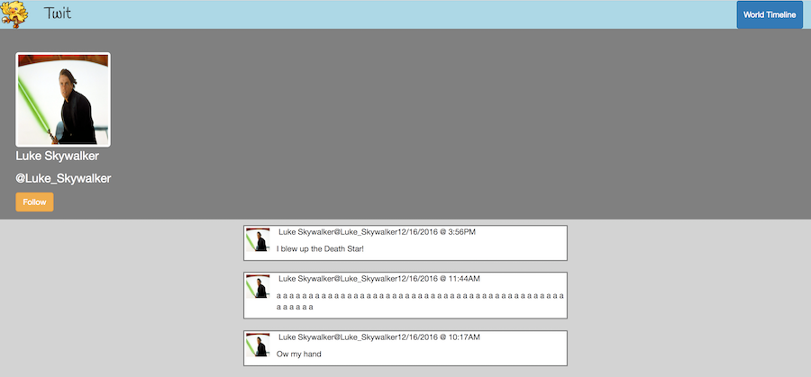

#Twit: An Exciting Twitter Clone!

##Overview:
Full stack project intended to implement MongoDB/Mongoose with NodeJS with AngularJS front end experience.  Twit is a clone of Twitter, and our intent was to implement as much basic functionality as possible in the alloted time for development.

Over the course of two days, we designed the back end functionality, tested the routes with Postman, and developed the service in Angular that would handle the AJAX calls to the server.

This was also an exercise in promises, on both the front and back end, developing greater familiarity with asynchronous routing.  

##Technologies:

###Front end:
AngularJS framework, utilizing Angular-ui-router

Bootstrap 

###Back end:
NodeJS
MongoDB
Modules:
  Express
  Mongoose
  BCrypt
  UUIDV4
  BodyParser
  Bluebird

####API back-end built using NodeJS(and a host of NPM modules), with the following functionality (and corresponding route handlers):
 Display a user-generated "Twit" message
 
 List and display Twit message of all users 
 
 User sign up (Secured password through Bcrypt)
 
 User login (Token generation and authentication through middleware)
 
 User Profile Page
 
 Ability to Follow other users and have their Twit messages display on your profile page
 
 Logout
  
####Example Code

Tweet Model:
```
const Tweet = mongoose.model('Tweet', {
  text: String,
  date: Date,
  user_id: String,
  name: String,
  avatar_url: String
});
```

Login Handler:
```
app.get('/userLogin', function(req, res) {
  var user_id = req.query.user_id;
  var password = req.query.password;
  var loginInfo = [];
  console.log(user_id);
  console.log(password);
  User.findById(user_id)
    .then(function(user) {
      console.log(user);
      bcrypt.compare(password, user.password)
      .then(function(success) {
        console.log(success);
        if (success){
         return success;
        }
        else{
          return 401;
        }
      })
      // create token, send over
      .then(function(){
        var token = uuidV4();
        loginInfo.push(user_id);
        loginInfo.push(token);
          res.send(loginInfo);
      });
      })
        .catch(function(err){
          res.status(400);
          res.send({error: err.message});
        });
      });
```





###Contributors:

#####Jason Campbell 
#####Kevin Farmer


